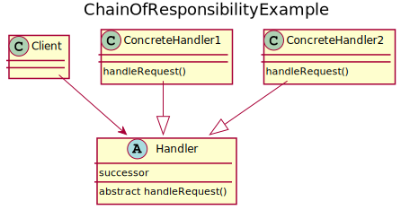

# Chain of Responsibility
Sometimes objects that send requests don’t know who should handle them and what the response should be. Chain of Responsibility provides a solution that gives multiple objects a chance to handle the request. The request gets passed along a chain of objects, from more specific to more general, until one of them handles it. Each object in the chain can either handle the request or forward it to the next candidate in the chain.

## UML diagram


<details>
<summary>PlantUML code:</summary>

```
@startuml
title ChainOfResponsibilityExample

class Client{

}

abstract class Handler{
    abstract handleRequest()
    successor
}

class ConcreteHandler1{
    handleRequest()
}

class ConcreteHandler2{
    handleRequest()
}

Client --> Handler
ConcreteHandler1 --|> Handler
ConcreteHandler2 --|> Handler

@enduml
```

</details>

The basic flow is:
1. A client triggers an event which needs a response, for example by clicking on a button.
2. The button object decides whether it should handle the request or forward it.
3. The request is passed on until an object handles the request.

## How to compile and run
Compile and run with:
```
mkdir build && cd build
g++ ../src/* -o executable -I ../include/
./executable
```
