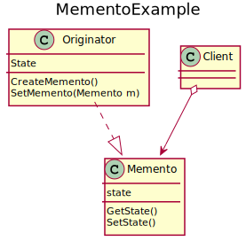

# Memento
Without violating encapsulation, Memento captures and externalizes an object’s internal state so that the object can be restored to this state later.
Memento is an object that stores a snapshot of the internal state of another object, which is called the memento’s originator. It is useful when there might be the need of going back to a previous state and the amount of information that the Memento object stores depends on the originator. Memento preserves an object’s encapsulation, avoiding to expose its internal state, by keeping it accessible only to the originator.

## UML diagram


<details>
<summary>PlantUML code:</summary>

```
@startuml
title MementoExample

class Memento{
    GetState()
    SetState()
    state
}

class Originator{
    CreateMemento()
    SetMemento(Memento m)
    State
}

class Client

Originator ..|> Memento
Client o--> Memento

@enduml
```

</details>

The basic flow is:
1. A Client requests a Memento from an Originator
2. As a result of this call, the Originator creates the Memento and sets it to its current state
3. After a while, the Client wants to go back to an older state of the Originator, so it calls the SetMemento() method on the Originator, which uses Memento’s GetState() method

## How to compile and run
Compile and run with:
```
mkdir build && cd build
g++ ../src/* -o executable -I ../include/
./executable
```
