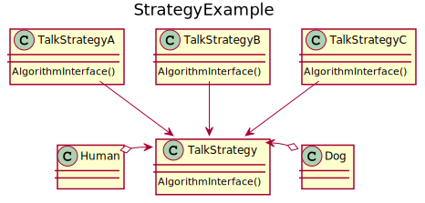

# Strategy
Thanks to the Strategy define pattern, a family of algorithms are defined, encapsulated and made interchangeable. Strategy lets the algorithm vary independently from clients that use it. This is especially useful when many related classes differ only in their behaviours: with Strategy a class can be configured to use one of many behaviours.

## UML diagram


<details>
<summary>PlantUML code:</summary>

```
@startuml
title StrategyExample


class TalkStrategy{
    AlgorithmInterface()
}

class Human{
    
}

class Dog{
    
}

class TalkStrategyA{
    AlgorithmInterface()
}

class TalkStrategyB{
    AlgorithmInterface()
}

class TalkStrategyC{
    AlgorithmInterface()
}

TalkStrategyA --> TalkStrategy
TalkStrategyB --> TalkStrategy
TalkStrategyC --> TalkStrategy

Human -[hidden] TalkStrategy
TalkStrategy -[hidden] Dog
Human o--> TalkStrategy
Dog o--> TalkStrategy

@enduml
```

</details>

The basic flow is:
1. Many similar classes need to use an algorithm in different ways
2. When they are created they set which of these algorithms they use
3. This choice can dynamically be changed during the lifetime of the object
4. The algorithms are encapsulated within a class so the clients do not need to know the details

## How to compile and run
Compile and run with:
```
mkdir build && cd build
g++ ../src/* -o executable -I ../include/
./executable
```
