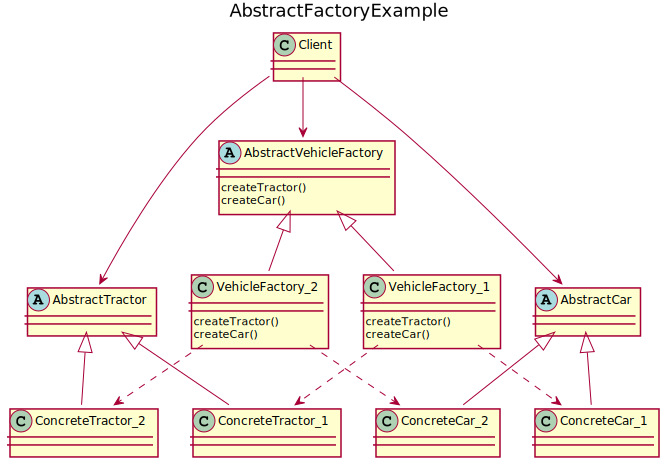

# Abstract Factory
This DP provides an interface to create families of related objects without specifying their concrete classes and it does so by speficying an interface for several factories. It is useful when many objects will be created or will change at runtime. A client uses the Abstract Factory to create the specific objects it requires.

## UML diagram


<details>
<summary>PlantUML code:</summary>

```
@startuml
title AbstractFactoryExample

abstract class AbstractVehicleFactory{
    {abstract} createTractor()
    {abstract} createCar()
}
class VehicleFactory_1{
    createTractor()
    createCar()
}
class VehicleFactory_2{
    createTractor()
    createCar()
}

class Client
abstract class AbstractTractor
abstract class AbstractCar
class ConcreteTractor_1
class ConcreteTractor_2
class ConcreteCar_1
class ConcreteCar_2

AbstractVehicleFactory <|-- VehicleFactory_1
AbstractVehicleFactory <|-- VehicleFactory_2

AbstractTractor <|-- ConcreteTractor_1
AbstractTractor <|-- ConcreteTractor_2
AbstractCar <|-- ConcreteCar_1
AbstractCar <|-- ConcreteCar_2

VehicleFactory_1 ..> ConcreteTractor_1
VehicleFactory_2 ..> ConcreteTractor_2
VehicleFactory_1 ..> ConcreteCar_1
VehicleFactory_2 ..> ConcreteCar_2

Client --> AbstractTractor
Client --> AbstractCar
Client --> AbstractVehicleFactory

@enduml 

```

</details>

The basic flow is:
1. A client requires an object to the Abstract Factory.
2. The Abstract Factory builds the required object by calling the factory that builds that object.
3. The newly created object is passed to the Client, which doesn't know which factory built the object.

## How to compile and run
Compile and run with:
```
mkdir build && cd build
g++ ../src/* -o executable -I ../include/
./executable
```
