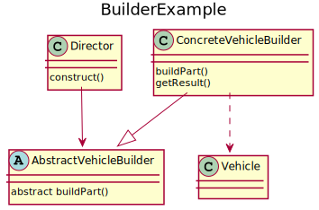

# Builder
Builder separates the construction of a complex object from its representation so that the same construction process can create different representations.
It is useful when complex objects need to be created and the components of each instantiation of such objects can vary.

## UML diagram


<details>
<summary>PlantUML code:</summary>

```
@startuml
title BuilderExample
class Director{
    construct()
}

abstract class AbstractVehicleBuilder{
    abstract buildPart()
}

class ConcreteVehicleBuilder{
    buildPart()
    getResult()
}

class Vehicle{

}

ConcreteVehicleBuilder --|> AbstractVehicleBuilder
ConcreteVehicleBuilder ..> Vehicle
Director --> AbstractVehicleBuilder

@enduml
```

</details>

[Explain elements of the diagram (Tractor, Excavator, Vehicle, etc..) and how they interact]

## How to compile and run
Compile and run with:
```
mkdir build && cd build
g++ ../main.cpp -o executable
./executable
```
