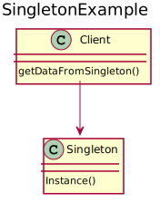

# Singleton
Singleton is used in those cases when only one instance of a class should be created. It ensures it by giving the responsibility to the only instance itself to avoid the creation of other objects of the same Singleton class. It also allows for strict control over how and when clients access its information.

## UML diagram


<details>
<summary>PlantUML code:</summary>

```
@startuml
title SingletonExample
class Singleton{
    Instance()
}

class Client{
    getDataFromSingleton()
}

Client --> Singleton

@enduml
```

</details>

The basic flow is:
1. A Singleton object is instantiated
2. When a Client needs information, it has the single point of access in the Singleton
3. The creation of another Singleton is always blocked

## How to compile and run
Compile and run with:
```
mkdir build && cd build
g++ ../src/* -o executable -I ../include
./executable
```
