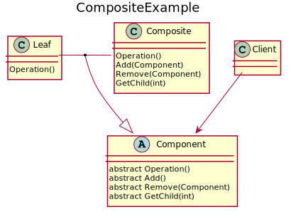

# Composite
Compose objects into tree structures to represent part-whole hierarchies. Composite lets clients treat individual objects and compositions of objects uniformly.
Objects in the composite structure can be primitive, i.e. lines, or containers, i.e. texts. The key of this pattern is to use an abstract class that represents both primitives and their containers. This class allows clients to treat objects uniformly across the composite structure.

## UML diagram


<details>
<summary>PlantUML code:</summary>

```
@startuml
title CompositeExample


abstract class Component{
    abstract Operation()
    abstract Add()
    abstract Remove(Component)
    abstract GetChild(int)
}

class Leaf{
    Operation()
}

class Composite{
    Operation()
    Add(Component)
    Remove(Component)
    GetChild(int)
}

class Client{
}

Client --> Component
Leaf - Composite 
(Leaf, Composite) --|> Component


@enduml 

```

</details>

The basic flow is:
1. Clients use the Component class interface to interact with objects in the composite structure
2. If the recipient is a Leaf, the request is handled directly, otherwise the Composite usually forwards the request to its child and might perform actions before and after the forwarding.

## How to compile and run
Compile and run with:
```
mkdir build && cd build
g++ ../src/* -o executable -I ../include/
./executable
```
