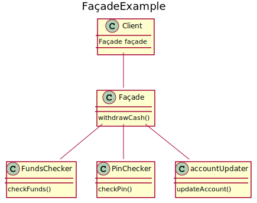

# Façade
Façade defines a higher-level interface that makes a set of sub-interfaces easier to use. This approach of providing a single, simplified interface reduces complexity.
For some specific clients that need more customizability, the façade interface still provides access to the lower levels.

## UML diagram


<details>
<summary>PlantUML code:</summary>

```
@startuml
title FaçadeExample

class Client{
    Façade façade
}

class Façade{
    withdrawCash()
}

class FundsChecker{
    checkFunds()
}

class PinChecker{
    checkPin()
}

class accountUpdater{
    updateAccount()
}

Façade -- FundsChecker
Façade -- PinChecker
Façade -- accountUpdater
Client -- Façade


@enduml

```

</details>

The basic flow is:
1. A client sends a request to Façade
2. Façade forwards the request to the appropriate subsystem object

## How to compile and run
Compile and run with:
```
mkdir build && cd build
g++ ../src/* -o executable -I ../include/
./executable
```
